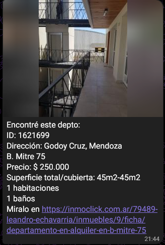
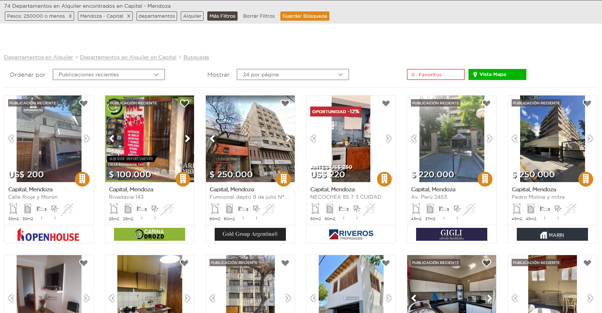
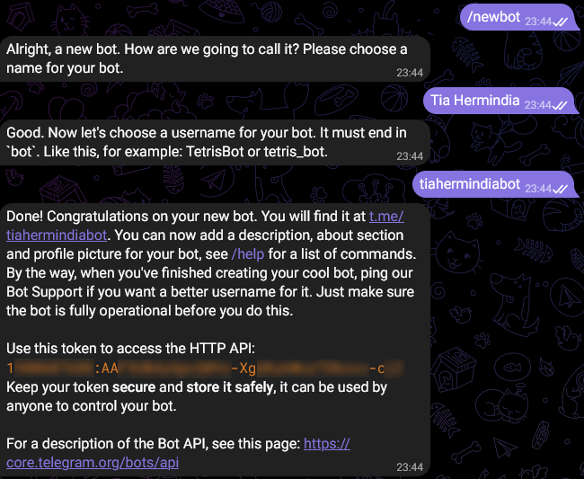

Sobre Inmobot
-
Inmobot es un simple scraper de Inmoclick que notifica a través de Telegram cuando aparece un inmueble nuevo que se ajusta a una búsqueda predefinida.

Inmobot fue una solución nacida de la bronca de haber perdido un departamento muy lindo por ser literalmente la segunda persona en ir a verlo, en un proceso de varios meses buscando un nuevo lugar donde vivir. Gracias a esto, y a una buena cuota de suerte, logré encontrar un nuevo lugar donde vivir después de pocos días.
También es mi primer solución aprendiendo Go. 

Inmoclick se convirtió en Inmoup. Por suerte, funcionalmente es lo mismo y el bot sigue funcionando. Solo hay que usar la nueva url.

Como funciona
-
En realidad es muy simple, la primera vez que corre guarda todos los inmuebles que ya existan en tu búsqueda como un punto de partida. Cada X minutos configurables, visita tu búsqueda, verifica si hay algún inmueble nuevo y si existe, envía el mensaje por telegram con los detalles del inmueble. Además, guarda este inmueble para no notificar dos veces por el mismo.

Como usar
-
Para usar Inmobot es necesario actualizar 3 parámetros en la configuración:
- **TelegramUserId**: Telegram ID del usuario que recibe las notificaciones.

Se puede obtener enviando un mensaje a [@userinfobot](t.me/userinfobot) 
- **InmoclickUrl**: link de la búsqueda en Inmoclick con los parámetros necesarios. Por ejemplo: https://inmoclick.com.ar/departamentos-en-alquiler?favoritos=0&limit=300&returnCompleteMap=0&prevEstadoMap=&lastZoom=5&cochera=1&precio[min]=&precio[max]=255000&moneda=1&sup_cubierta[min]=&sup_cubierta[max]=&expensas[min]=&expensas[max]=

Es la url en la búsqueda en su formato grilla.

- **TelegramBotToken**: token que devuelve [@BotFather](t.me/BotFather) cuando se crea el bot. [Guía para crear un bot](https://core.telegram.org/bots/features#botfather).

Links
-
Inmobot no es más que un montón de recursos de la comunidad con su pegamento, así que todo de:
- [mattn/go-sqlite3](https://github.com/mattn/go-sqlite3)
- [gocolly/colly](https://github.com/gocolly/colly)
- [go-telegram/bot](https://github.com/go-telegram/bot)
- [wangyoucao577/go-release-action](https://github.com/wangyoucao577/go-release-action)